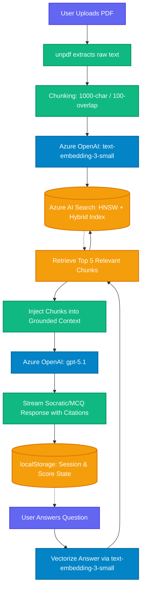

# 🧬 MedViva AI — Your Ruthless 24/7 AI Medical Examiner

[](#)
[](#)
[](#)

> **Track:** Battle #1 — Creative Apps with GitHub Copilot

---

## 😰 The Problem We're Solving

Every year, over **200,000 Indian medical graduates** appear for NEET-PG — one of the most competitive postgraduate entrance exams in the world. The pass rate hovers around **10-15%**.

The tragedy? **The way they study is broken.**

Medical students spend 5–6 years accumulating massive, dense textbooks (Pathology, Pharmacology, Surgery…). But when exam day comes, they are tested through **high-pressure oral viva examinations and MCQ papers** — formats that require instant recall, mechanism-level reasoning, and the ability to think *out loud* under stress.

**The gap:** Students read silently, alone. But they are examined verbally and under timed pressure. Nobody trains them for the actual format of the exam.

The old solution is to pay thousands of rupees for coaching institutes, find a senior who will spare time, or join a group viva session where 30 students share one teacher. **Access to a relentless, always-available examiner has always been a privilege of the rich.**

---

## 💡 Our Solution: MedViva AI

**MedViva AI** turns any medical textbook into a personal AI examiner that is:

### Core Features & Functionality

- **Dual-Mode Examination:** Toggle seamlessly between an open-ended "Viva Mode" (Socratic dialogue) and "MCQ Mode" (Board-style objective questions based on clinical vignettes).
- **Two-Tier Safety Guardrails:** MedViva AI doesn't just block hallucination; it actively validates context against global medical consensus. It uses a two-tier flagging system (`[!CAUTION]` for life-threatening errors vs `[!INFO]` for regional variations) to catch dangerous errors in uploaded textbooks.
- **Clinical Consensus Override & Audit Logging:** If a dangerous source contradiction is detected, the AI preserves exam flow but triggers a persistent, un-dismissable safety banner that requires a manual "Mark as Reviewed with Faculty" acknowledgement—creating a standard medico-legal audit trail.
- **Mastery Matrix & Document Reliability (BRI):** A dynamic "Board Readiness Index" tracks your session progress. It also calculates a **Confidence Modifier** based on the number of source conflicts detected in your document, acknowledging the formula: *True Readiness = Student Accuracy × Document Reliability*.
- **Strict Document Isolation:** Upload your PDF textbook into one of the 19 dedicated NEET-PG subject tabs (Pathology, Anatomy, etc.). The AI creates an isolated vector memory space for that subject so Pathology questions never bleed into Physiology.
- **Persistent Knowledge Base:** Your uploaded textbooks are saved to their respective subjects. Clicking "+ New Session" wipes your chat history for a fresh exam, but preserves your document context.
- **Saved Questions Bank:** A premium, built-in revision bank. Click the "Save" bookmark on any high-yield AI question to store it in a beautifully formatted, full-width vertical accordion list for later review.

- **Relentlessly Socratic** — It doesn't give you the answer. It asks *why*. It probes. It cross-questions until you truly understand.
- **Grounded in YOUR notes** — Upload your textbook PDF. The AI examines you *only* on what you uploaded. No hallucinations. Every single correction is cited back to a page number.
- **Available 24/7, for free** — A student in rural Bihar gets the same examiner quality as a student at AIIMS Delhi.
- **Smart Fallback** — Even if you upload a scanned/image-based PDF (0 extracted text), MedViva AI falls back to its internal medical knowledge to keep your session going. No crashes. No refusals.
- **All 19 NEET-PG subjects covered** — Anatomy, Physiology, Biochemistry, Pathology, Pharmacology, Microbiology, FMT, SPM, General Medicine, Surgery, OBG, Pediatrics, ENT, Ophthalmology, Orthopedics, Radiology, Anesthesia, Dermatology, Psychiatry.

---

## 🎯 The Vision

> *"Every medical student in India deserves a ruthless examiner in their pocket."*

Our long-term vision is a platform where:

1. **Any student can upload any textbook** and be examined on it immediately — Marrow, Harrison's, Bailey & Love, Datta, anything.
2. **Weak areas are tracked** over sessions — the AI knows where you keep going wrong and intensifies its focus there.
3. **Community question banks** allow students to share curated PDF exam sets vetted by toppers.
4. **Institutions can deploy** their own private MedViva instance pre-loaded with their curriculum, replacing costly mock-viva sessions.

The endgame: **democratize medical exam preparation** by making the highest quality Socratic examination available to every student, not just those who can afford it.

---

## 🧠 Why MedViva is Not a Study App (Clinical Reasoning Engine)

The 1000-page textbook → thousands of semantic vectors → instant cross-subject retrieval → continuous mastery tracking pipeline is **not a study app. That's a clinical reasoning training system.**

The scale matters. Azure AI Search indexing a full professional medical textbook means the Socratic Engine can:

- Pull a rare complication from Chapter 47
- Connect it to a pharmacology concept from Chapter 12
- Test whether the student understands the link

**No human tutor can do that across 1000 pages in real time. No flashcard app attempts it.**

---

## 🚀 The Demo Paths (For Judges)

> [!IMPORTANT]
> **API Keys Required:** To run these demos locally, you must first configure your `.env.local` file with your own Azure AI Foundry and Azure AI Search API keys. See the **Local Setup** section below for instructions.

We know your time is valuable. Two instant-access paths:

### Path 1 — One-Click Quick Demo (10 seconds)
1. Open the app at `http://localhost:3000`
2. Click **`🚀 Launch Quick Demo (Pre-Loaded)`** on the onboarding screen
3. Select **Pathology** from the left sidebar
4. Hit **Start Session**
5. The AI immediately fires a clinical vignette about CML (Chronic Myeloid Leukemia)

No file upload needed. Pre-loaded context is baked directly into the API.

### Path 2 — Full Pipeline Test (2 minutes)
1. Download `Sample-Medical-Textbook-For-Demo.pdf` from the root of this repository
2. Drag and drop it into the upload area in the sidebar
3. Wait ~5 seconds for Azure AI Search to index it
4. Select any topic → Watch the AI ground every question in your specific document with page citations
5. Switch between **Viva Mode** and **MCQ Mode** to see both examination formats

---

## 🏗️ Architecture: Foundry IQ RAG Pipeline



**Key Guard-Rails:**
- **API-level block:** If no filename is sent from the client, vector search is completely skipped — no cross-document leakage possible.
- **Smart fallback:** If the PDF yields no extractable text (scanned/image PDF), both Viva and MCQ modes fall back to internal medical knowledge and always generate a question.
- **Document isolation:** Each topic (`medviva-topic-{subject}`) has its own isolated localStorage slot.

---

## ⚙️ Tech Stack

| Layer | Technology |
|-------|-----------|
| Frontend | Next.js 16 (App Router), React, CSS Modules |
| Backend | Next.js API Routes (Node.js runtime) |
| AI — Chat | Azure OpenAI `gpt-5.1` |
| AI — Embeddings | Azure OpenAI `text-embedding-3-small` |
| Vector Search | Azure AI Search (HNSW + Hybrid Semantic) |
| Document Parsing | `unpdf` (serverless-safe, no canvas/worker deps) |
| Session Persistence | Browser `localStorage` (metadata only, no raw PDF data) |
| Dev Assistance | GitHub Copilot (inline + agent mode) |

---

## 🤖 GitHub Copilot Usage

GitHub Copilot was an active co-developer throughout this project:

- **Component Scaffolding** — Used Copilot Chat to generate React component structures and CSS Module skeletons for the chat UI, sidebar, and score panel.
- **Complex Regex** — Copilot generated the SSE streaming parser and the MCQ XML tag extraction regex (`/<correct>[\s\S]*?<\/correct>/gi`).
- **System Prompt Hardening** — Copilot Agent mode was used to iteratively tighten the guardrail logic in `lib/system-prompt.ts`, preventing hallucination fallbacks and eliminating contradictory "knowledge confinement" rules.
- **API Route Logic** — The hard-block refusal pattern and document-isolation guard in `app/api/chat/route.ts` were pair-programmed with Copilot suggestions.
- **State Management** — Copilot helped architect the per-topic localStorage persistence strategy to avoid Next.js hydration errors.

---

## 📥 Local Setup

### Prerequisites
- Node.js 18+
- An Azure account with:
  - Azure OpenAI resource (with `gpt-5.1` and `text-embedding-3-small` deployments)
  - Azure AI Search resource

### Steps

```bash
# 1. Clone the repo
git clone <your-repo-url>
cd medviva-ai

# 2. Install dependencies
npm install

# 3. Copy the example env file and fill in your keys
cp .env.example .env.local
# Edit .env.local with your Azure credentials

# 4. Run the development server
npm run dev

# 5. Open the app
# http://localhost:3000
```

### Environment Variables (see `.env.example`)

```
AZURE_OPENAI_CHAT_ENDPOINT=
AZURE_OPENAI_CHAT_API_KEY=
AZURE_OPENAI_CHAT_DEPLOYMENT=

AZURE_OPENAI_EMBEDDING_ENDPOINT=
AZURE_OPENAI_EMBEDDING_API_KEY=
AZURE_OPENAI_EMBEDDING_DEPLOYMENT=

AZURE_SEARCH_ENDPOINT=
AZURE_SEARCH_API_KEY=
AZURE_SEARCH_INDEX_NAME=

AZURE_OPENAI_API_VERSION=
```

---

## 📁 Repository Structure

```
medviva-ai/
├── app/
│   ├── page.tsx              # Landing page
│   ├── viva/
│   │   ├── page.tsx          # Main examination interface (Viva + MCQ)
│   │   └── viva.module.css   # Scoped styles
│   └── api/
│       ├── chat/route.ts     # AI chat endpoint (RAG pipeline + guardrails)
│       ├── upload/route.ts   # PDF upload & async indexing endpoint
│       └── index-status/     # Job polling endpoint
├── lib/
│   ├── azure-search.ts       # Azure AI Search client & retrieval
│   ├── azure-openai.ts       # Azure OpenAI streaming client
│   ├── chunker.ts            # Recursive text splitter + PDF extraction
│   └── system-prompt.ts      # Guardrail prompts (Viva + MCQ modes)
├── public/
│   └── demo-assets/
│       └── High-Yield-Pathology-Demo.pdf
├── scripts/
│   ├── generate-pdf.js       # PDF generation utility
│   └── index-demo.js         # Demo indexing utility
├── Sample-Medical-Textbook-For-Demo.pdf  ← Download & test with this
├── .env.example
└── README.md
```

---

*Built with ❤️ for the Microsoft Agents League Hackathon 2026*
*"Every medical student deserves a ruthless examiner in their pocket."*
